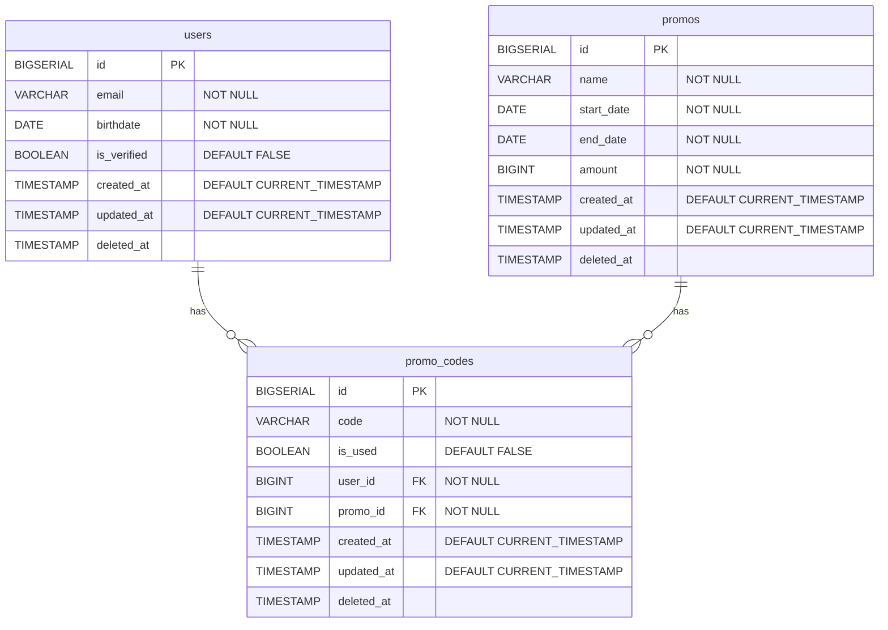

# SayaKaya

This is a technical test from SayaKaya implemented using the Go programming language and CLEAN architecture.

## Features

- Add user.
- Retrieve a list of users.
- Retrieve the user by ID.
- Verify the user with its ID.
- Add promo.
- Retrieve a list of promotions.
- Generate a promo code.
- Redeem the promo code.

## Assumptions

- Newly added users are not verified by default.
- Verification needs to be done manually for each user.
- The scheduler will send an email with the promo code to users who celebrate their birthdays that day at 00:00 (UTC+00:00).
- The promo code consists of six characters in the lower-case Latin alphabet.
- The promo code can be manually generated or automatically generated and sent by the scheduler.
- The promo code can only be redeemed by verified users.
- The promo code can only be redeemed by the user who owns it.
- The promo code can only be redeemed if it's not expired yet.
- The promo code can only be redeemed once.

## Database design



## How to run

```bash
sudo docker compose up
```

## Documentation

[Postman](https://documenter.getpostman.com/view/30182819/2s9YeBdYpQ)
